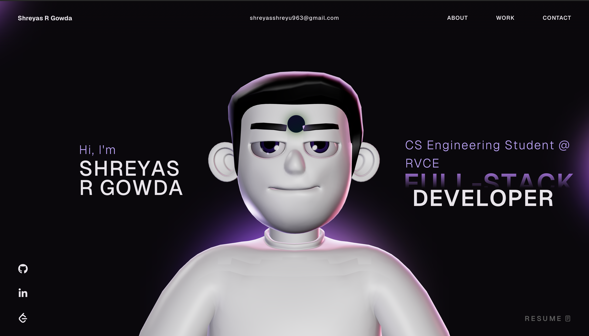

# Shreyas R Gowda — Portfolio

[](https://reactjs.org)
[](https://typescriptlang.org)
[](https://threejs.org)
[](https://gsap.com)
[](https://vitejs.dev)
[](https://shreyas-r-gowda.github.io/shreyas-portfolio/)

> Personal portfolio site featuring an interactive 3D character, scroll-driven animations, and a dark WebGL aesthetic — built with React, TypeScript, Three.js, and GSAP.

**🌐 Live site:** [shreyas-r-gowda.github.io/shreyas-portfolio](https://shreyas-r-gowda.github.io/shreyas-portfolio/)

---



---

## Features

- **Interactive 3D character** rendered in real-time via Three.js and WebGL
- **Scroll-driven animations** using GSAP ScrollTrigger — sections animate as you scroll
- **Smooth page transitions** and entrance effects throughout
- **Responsive layout** — works across desktop and mobile viewports
- **Sections:** Hero, About, Work (projects), Contact
- **CI/CD** — automatic deployment to GitHub Pages on every push to `main` via GitHub Actions

---

## Tech stack

| Layer      | Technology                    |
| ---------- | ----------------------------- |
| Framework  | React 18 + TypeScript         |
| 3D / WebGL | Three.js                      |
| Animations | GSAP + ScrollTrigger          |
| Styling    | CSS (custom)                  |
| Build tool | Vite                          |
| Deployment | GitHub Pages + GitHub Actions |

---

## Project structure

```
shreyas-portfolio/
├── public/                 # Static assets (3D models, fonts, images)
├── src/
│   ├── components/         # Reusable UI components
│   │   ├── Hero/           # Landing section with 3D character
│   │   ├── Work/           # Projects showcase
│   │   ├── About/          # About me section
│   │   └── Contact/        # Contact section
│   ├── assets/             # Icons, images, static media
│   └── data/               # Project data and constants
├── .github/workflows/      # GitHub Actions CI/CD
├── vite.config.ts
├── tsconfig.json
└── index.html
```

---

## Getting started

### Prerequisites

- Node.js 18+
- npm 9+

### Installation

```bash
# Clone the repository
git clone https://github.com/Shreyas-R-Gowda/shreyas-portfolio.git
cd shreyas-portfolio

# Install dependencies
npm install

# Start development server
npm run dev
```

The site runs at **http://localhost:5173** by default.

### Build for production

```bash
npm run build
```

Output goes to `./dist`. The `vite.config.ts` base path is set to `/shreyas-portfolio/` for GitHub Pages deployment.

---

## Deployment

The repository uses GitHub Actions to auto-deploy on every push to `main`.

The workflow (`.github/workflows/deploy.yml`):

1. Checks out the code
2. Sets up Node 22
3. Runs `npm ci && npm run build`
4. Uploads `./dist` as a GitHub Pages artifact
5. Deploys to GitHub Pages

No manual steps needed — push to `main` and the live site updates within ~1 minute.

---

## License

This project is shared for learning and inspiration.

You are welcome to reference the code and techniques. If you use parts of it, please credit back to this repository. Do not replicate the full site design or use it for commercial work.

---

## Author

**Shreyas R Gowda**
B.E. (CSE) · R.V. College of Engineering, Bengaluru
[GitHub](https://github.com/Shreyas-R-Gowda) · [LinkedIn](https://linkedin.com/in/shreyas-r-gowda) · shreyasshreyu963@gmail.com
